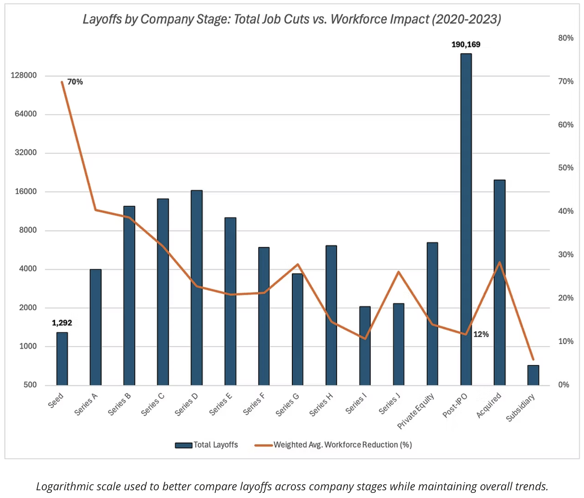

# How Layoffs Reshaped the Workforce: Trends and Patterns (2020-2023)

## Table of Contents

- [Project Background](#project-background)
- [Data Structure & Initial Checks](#data-structure--initial-checks)
- [Executive Summary](#executive-summary)
- [Insights Deep Dive](#insights-deep-dive)
  - [Overall Layoff Trends](#overall-layoff-trends)
  - [Major Layoff Events and Corporate Impact](#major-layoff-events-and-corporate-impact)
  - [Industry-Specific Layoff Analysis](#industry-specific-layoff-analysis)
  - [Geographic Differences in Workforce Reductions](#geographic-differences-in-workforce-reductions)
  - [Company Stage and Financial Health](#company-stage-and-financial-health)
- [Recommendations](#recommendations)
- [Assumptions and Caveats](#assumptions-and-caveats)

## Project Background

Layoffs serve as a critical indicator of economic shifts, corporate restructuring, and industry downturns. This project analyzes global layoffs from March 2020 to March 2023, identifying patterns across industries, company sizes, and geographic regions. Using SQL, I explored workforce reductions, major corporate downsizing events, and sector-wide impacts to uncover the key drivers behind layoffs. The findings provide valuable insights for businesses and policymakers navigating employment trends and economic fluctuations.

The SQL queries used to inspect and clean the data for this analysis can be found here.

Targeted SQL queries used for exploratory analysis can be found here.

Raw datasets in Excel format can be found here.

## Data Structure & Initial Checks

The dataset includes 2,361 records of layoffs from 2020 to 2023, detailing company names, locations, industries, layoff figures, workforce impact percentages, funding stages, and layoff dates.

### Data Cleaning Steps:
To ensure data integrity, the following cleaning steps were taken:
- Used `ROW_NUMBER()` to eliminate redundant records based on company, industry, and location.
- Applied `TRIM()` to remove extra spaces and formatting inconsistencies.
- Used self-joins to infer likely classifications based on similar company/location data.
- Used `STR_TO_DATE()` to ensure proper time-series analysis.

## Executive Summary

Global layoffs skyrocketed by 915% from 2021 to 2022, with tech, retail, and consumer industries among the hardest hit, and the U.S. accounting for two-thirds of all job cuts. Post-IPO companies led in total layoffs with over 204,000 job cuts, while early-stage startups faced the highest workforce reductions, cutting up to 70% of their employees. These trends underscore the importance of strategic hiring, financial resilience, and adaptability as businesses brace for ongoing economic uncertainty.

## Insights Deep Dive

### Overall Layoff Trends
- Layoff patterns changed significantly over the three years, reflecting both short-term volatility and long-term workforce reductions. 
- Layoffs surged by 915% from 2021 (15,823 layoffs) to 2022 (160,661 layoffs), signaling a major shift in workforce strategies. 
- By March 2023, total layoffs reached 383,159, underscoring the scale of job losses over time. While some months saw lower layoff activity, workforce reductions steadily accumulated, particularly in 2022 and early 2023. 

  
  
- January 2023 saw the highest single-month layoffs (84,714), driven by widespread corporate downsizing, particularly in tech.

  

- These trends suggest that companies initially expanded their workforces during the pandemic but later scaled back aggressively. 
- While some layoffs were concentrated in high-profile events, the broader trend shows a steady increase in job cuts, with 2022 and early 2023 accounting for the majority of reductions.

### Major Layoff Events and Corporate Impact
- The largest single layoff recorded was at Google, occurring on January 20, 2023, with 12,000 employees cut, representing six percent of its workforce.
- Some companies shut down entirely, such as Katerra (2,434 layoffs) and Butler Hospitality (1,000 layoffs), likely due to financial struggles.
- Amazon led in total layoffs with 18,150 job cuts, followed by Google (12,000) and Meta (11,000), suggesting that tech companies, after rapid pandemic-era hiring, made significant reductions.

  

### Industry-Specific Layoff Analysis
- Consumer sector layoffs totaled 45,182, highlighting how economic slowdowns disproportionately impacted consumer-focused industries.
- Retail followed closely with 43,613 layoffs, reflecting widespread challenges in the sector. Given the scale of these job cuts, both brick-and-mortar and e-commerce businesses may have been affected.
- Transportation saw 33,748 layoffs, while Finance recorded 28,344 job cuts, highlighting significant workforce reductions in both sectors during this period.
  
  

### Geographic Differences in Workforce Reductions
- The United States experienced the highest number of layoffs with 256,559 job losses, primarily in technology, retail, and finance.
- India recorded 35,993 layoffs and the Netherlands had 17,220, making them the most affected countries outside the United States.
- The widespread nature of layoffs across continents underscores that the economic downturn was not limited to a single region but affected businesses globally.

  
### Company Stage and Financial Health
- A loose positive correlation can be seen between company layoffs and total funds raised, with companies that secured more funding often laying off more employees. However, layoffs occurred at all funding levels, indicating that financial backing alone did not prevent workforce reductions.

  
  
- Drilling down by company financing stage, companies that recently went public experienced the highest total layoffs, with 204,132 job cuts, highlighting the challenges of staying profitable after an IPO.
- However, when considering workforce impact relative to company size, early-stage startups were the most vulnerable:
  - Seed-stage startups had an average workforce reduction of 70%, with most losing more than two-thirds of their employees.
  - Series A (40.5%) and Series B (39%) also saw high workforce reductions, indicating that younger companies struggled the most to sustain headcount.
  - Later-stage companies such as Series I (11%) and subsidiaries (6%) had lower relative layoff rates, suggesting they had more financial stability.

&nbsp;
  &nbsp;&nbsp;&nbsp;&nbsp;

## Recommendations
Based on the insights and findings above, I would recommend companies to consider the following:
- Strengthen economic forecasting to anticipate downturns and prevent excessive hiring during periods of uncertainty.
- Adopt cautious financial planning, particularly for startups, to ensure long-term stability and sustainable growth.
- Invest in workforce retraining and up-skilling to help employees transition into new roles, especially in vulnerable industries like Consumer and Retail.
- Diversify revenue streams to reduce reliance on a single business model, improving resilience in shifting market conditions.

## Assumptions and Caveats

Throughout the analysis, multiple assumptions were made to manage challenges with the data. These assumptions and caveats are noted below:
- Layoff counts are based on publicly reported figures, so smaller company layoffs may be underrepresented.
- Over 40,000 layoffs come from companies with "Unknown" financial stages, limiting direct financial-stage comparisons.
- Industry classifications were standardized, but some variation may still exist depending on how companies categorize themselves.
- External factors like inflation, interest rate hikes, and political events also influence layoffs, but this dataset does not capture all of them.
---
- The SQL queries used to inspect and clean the data for this analysis can be found here.
- Targeted SQL queries used for exploratory analysis can be found here.
- Raw dataset in Excel format can be found here.
- For more of my projects and data journey, visit my portfolio website and reach out!
